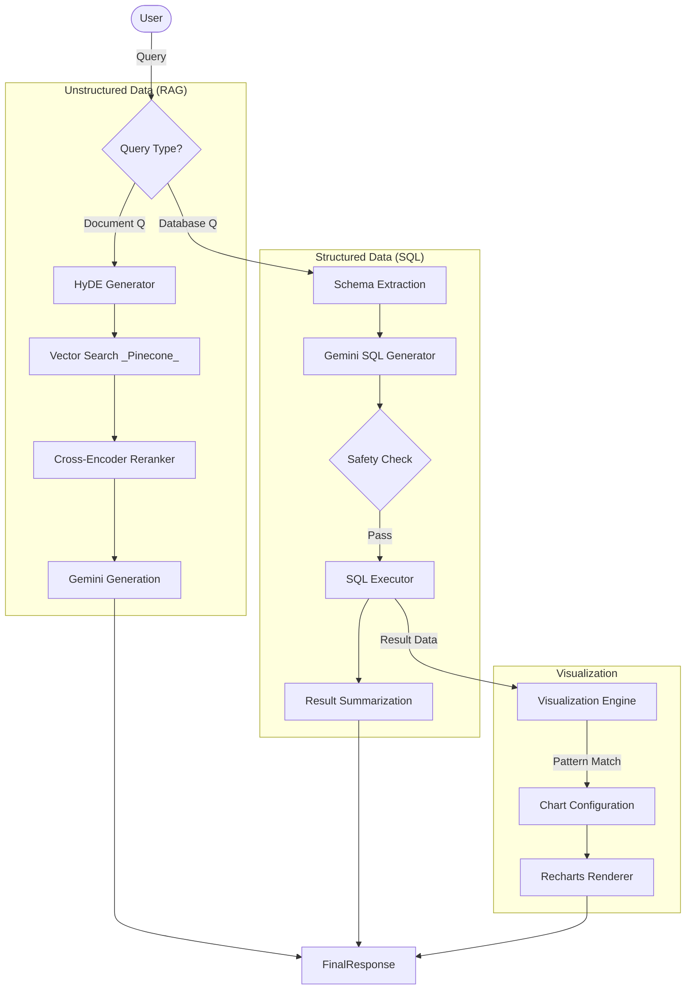

# DocuMind System Architecture & API Documentation

## 1. Executive Summary

This document provides a comprehensive technical overview of the **Modular RAG System** (MINI). It details the architecture for Unstructured Data (RAG), Structured Data (Text-to-SQL), and Automatic Visualization.

## 2. Architecture Overview

### 2.1 The "Trinity" Architecture

The system is composed of three distinct intelligence pipelines that work in parallel:

1. **RAG Pipeline**: For answering questions from unstructured documents (PDF/DOCX).
2. **SQL Pipeline**: For answering questions from structured databases via SQL generation.
3. **Visualization Pipeline**: For analyzing database results and generating charts.

### 2.2 System Flowchart

---

## 3. RAG Pipeline (Unstructured)

### 3.1 Indexing Strategy

- **Small-to-Big Chunking**:
  - **Child Chunks**: 300 characters. Embedded (FastEmbed `bge-small-en-v1.5`) and stored in Pinecone.
  - **Parent Chunks**: 1500 characters. Stored in MongoDB.
  - **Logic**: Search matches small, detailed segments (Child) but retrieves the full context (Parent) for the LLM.
- **Tenancy**: Every document key is prefixed with `username` metadata.

### 3.2 Retrieval & Ranking

1. **HyDE (Pre-Retrieval)**: Generates a hypothetical answer to the query to improve semantic matching.
2. **Vector Search**: Retrieves top 50 candidates using Cosine Similarity (**Vector Score**).
3. **Reranking (Post-Retrieval)**:
   - Uses a local Cross-Encoder (`ms-marco-MiniLM-L-12-v2` via FlashRank).
   - Assigns a **Resonance Score (R)** to every chunk.
   - **Scoring Logic**: STRICT mode. The system uses the Reranker score as the ground truth. Vector scores are only for candidate selection.

---

## 4. Text-to-SQL Pipeline (Structured)

### 4.1 Schema Extraction

- **Service**: `SQLAnalysisService`
- **Method**: Dynamic introspection using `SQLAlchemy.inspect`.
- **Formatting**: Converts raw schema tables/columns into a context-optimized prompt for the LLM (e.g., annotated types, primary keys).

### 4.2 Generation & Safety

- **Prompt Engineering**: Uses rigid constraints (e.g., "no Markdown", "Single Line").
- **Validator (`_validate_sql`)**:
  1. **Keyword Blocklist**: Rejects `DROP`, `DELETE`, `INSERT`, `UPDATE`, `ALTER`.
  2. **Structure Check**: Enforces `SELECT` start and presence of `FROM` clause.
  3. **Syntax Check**: Balances quotes/parentheses.

---

## 5. Visualization Pipeline

### 5.1 Auto-Detection

- **Service**: `DatabaseVisualizationService`
- **Logic**: Analyzes query results to determine chart suitability.
  - **Bar**: Categorical X (Top <15), Numerical Y.
  - **Line**: Date/Time X.
  - **Pie**: Categorical (<8 items), Sum = 100% (approx).

### 5.2 Client-Side Rendering

- **Config**: Backend returns a `ChartConfig` JSON object (not raw data).
- **Component**: `Chart.jsx` receives the config and dynamically instantiates `BarChart`, `LineChart`, or `PieChart` using `Recharts`.

---

## 6. API Reference

### 6.1 Authentication

All endpoints require `Authorization: Bearer <jwt_token>`.

### 6.2 RAG Endpoints

| Method   | Endpoint            | Description                                                           |
| :------- | :------------------ | :-------------------------------------------------------------------- |
| `POST` | `/api/rag/upload` | Upload PDF/DOCX/TXT files.                                            |
| `POST` | `/api/rag/query`  | Ask a question. Returns `answer` and `sources` (with R/V scores). |

### 6.3 Chat & Session

| Method     | Endpoint                    | Description                             |
| :--------- | :-------------------------- | :-------------------------------------- |
| `POST`   | `/api/chat/sessions`      | Create a new session (lazy-init).       |
| `GET`    | `/api/chat/sessions`      | List user sessions (sorted by Recency). |
| `DELETE` | `/api/chat/sessions/{id}` | Delete a session and its history.       |

### 6.4 Visualization

| Method   | Endpoint                      | Description                                         |
| :------- | :---------------------------- | :-------------------------------------------------- |
| `POST` | `/api/visualization`        | Get metadata/suggestions for a database connection. |
| `POST` | `/api/visualization/custom` | Generate specific chart data based on params.       |

---

## 7. Security & Infrastructure

### 7.1 API Key Management

- **Hierarchy**: User Keys > System Keys.
- **Privacy**: User keys are transient and used only for their session.

### 7.2 Session Management

- **Persistence**: MongoDB Atlas.
- **Lazy Creation**: Sessions are only created when the first message is sent to prevent DB spam.
- **Auto-Narning**: Background job generates 3-4 word titles based on the first interaction.
